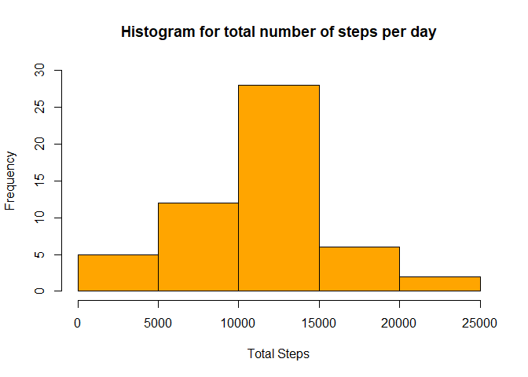
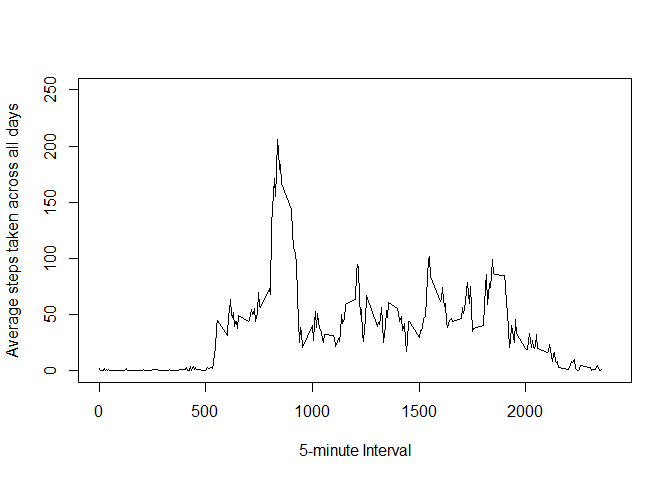
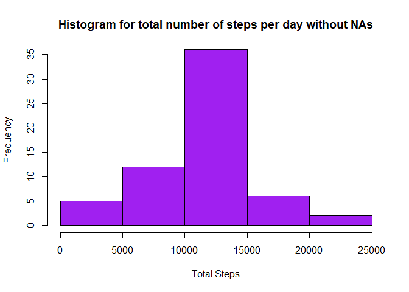
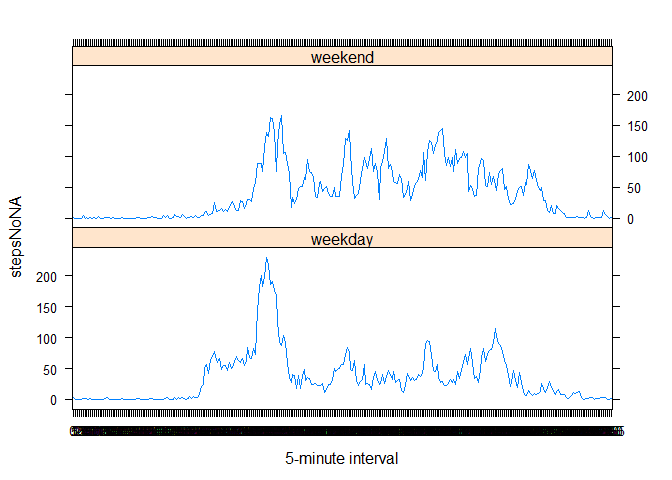

```r
activity <- read.csv(file= "C:/Users/Jinny Qu/Desktop/R Programming/activity.csv", header=TRUE, sep = ",")
```

### What is mean total number of steps taken per day


```r
TotalSteps <- tapply(activity$steps, activity$date, sum)
hist(TotalSteps, main = "Histogram for total number of steps per day", xlab = "Total Steps", border = "black", col = "orange", ylim = c(0,30))
```

<!-- -->

#### mean and median of the total number of steps taken per day

```r
meanSteps <- tapply(activity$steps, activity$date, mean, na.rm = TRUE)
medianSteps <- tapply(activity$steps, activity$date, median, na.rm = TRUE)
cbind(meanSteps, medianSteps)
```

```
##             meanSteps medianSteps
## 2012-10-01        NaN          NA
## 2012-10-02  0.4375000           0
## 2012-10-03 39.4166667           0
## 2012-10-04 42.0694444           0
## 2012-10-05 46.1597222           0
## 2012-10-06 53.5416667           0
## 2012-10-07 38.2465278           0
## 2012-10-08        NaN          NA
## 2012-10-09 44.4826389           0
## 2012-10-10 34.3750000           0
## 2012-10-11 35.7777778           0
## 2012-10-12 60.3541667           0
## 2012-10-13 43.1458333           0
## 2012-10-14 52.4236111           0
## 2012-10-15 35.2048611           0
## 2012-10-16 52.3750000           0
## 2012-10-17 46.7083333           0
## 2012-10-18 34.9166667           0
## 2012-10-19 41.0729167           0
## 2012-10-20 36.0937500           0
## 2012-10-21 30.6284722           0
## 2012-10-22 46.7361111           0
## 2012-10-23 30.9652778           0
## 2012-10-24 29.0104167           0
## 2012-10-25  8.6527778           0
## 2012-10-26 23.5347222           0
## 2012-10-27 35.1354167           0
## 2012-10-28 39.7847222           0
## 2012-10-29 17.4236111           0
## 2012-10-30 34.0937500           0
## 2012-10-31 53.5208333           0
## 2012-11-01        NaN          NA
## 2012-11-02 36.8055556           0
## 2012-11-03 36.7048611           0
## 2012-11-04        NaN          NA
## 2012-11-05 36.2465278           0
## 2012-11-06 28.9375000           0
## 2012-11-07 44.7326389           0
## 2012-11-08 11.1770833           0
## 2012-11-09        NaN          NA
## 2012-11-10        NaN          NA
## 2012-11-11 43.7777778           0
## 2012-11-12 37.3784722           0
## 2012-11-13 25.4722222           0
## 2012-11-14        NaN          NA
## 2012-11-15  0.1423611           0
## 2012-11-16 18.8923611           0
## 2012-11-17 49.7881944           0
## 2012-11-18 52.4652778           0
## 2012-11-19 30.6979167           0
## 2012-11-20 15.5277778           0
## 2012-11-21 44.3993056           0
## 2012-11-22 70.9270833           0
## 2012-11-23 73.5902778           0
## 2012-11-24 50.2708333           0
## 2012-11-25 41.0902778           0
## 2012-11-26 38.7569444           0
## 2012-11-27 47.3819444           0
## 2012-11-28 35.3576389           0
## 2012-11-29 24.4687500           0
## 2012-11-30        NaN          NA
```
### What is the average daily activity pattern?


```r
activity[,"interval"] <- as.factor(activity[, "interval"])
averageAllDays <- tapply(activity$steps, activity$interval, mean, na.rm = TRUE)
plot(row.names(averageAllDays), averageAllDays, type = "l", xlim = c(0,2400), ylim = c(0,250), xlab = "5-minute Interval", ylab = "Average steps taken across all days")
```

<!-- -->

#### The the 5-minute interval that contains the max number of steps

```r
averageAllDays[which(averageAllDays == max(averageAllDays))]
```

```
##      835 
## 206.1698
```
### Imputing missing values

```r
missingValues <- length(is.na(activity$steps))
#Total number of missing values
missingValues
```

```
## [1] 17568
```

```r
averageAllDays <- as.data.frame.table(averageAllDays)
colnames(averageAllDays) <- c("interval", "averageAllDays")
#I replaced the NA values with the mean for that 5-minute interval
stepsNoNA <- ifelse(is.na(activity$steps), replace(activity$steps, activity$interval %in% averageAllDays$interval, averageAllDays$averageAllDays), activity$steps)
df <- cbind(activity, stepsNoNA)
activityNoNA <- df[, c(2,3,4)]#new dataset without NAs
TotalStepsNNA <- tapply(activityNoNA$steps, activityNoNA$date, sum)
hist(TotalStepsNNA, main = "Histogram for total number of steps per day without NAs", xlab = "Total Steps", border = "black", col = "purple", ylim = c(0,35))
```

<!-- -->

```r
meanStepsNNA <- tapply(activityNoNA$steps, activityNoNA$date, mean, na.rm = TRUE)
medianStepsNNA <- tapply(activityNoNA$steps, activityNoNA$date, median, na.rm = TRUE)
cbind(meanStepsNNA, medianStepsNNA)# By imputing missing data, there are now means and medians of the days where there was no data. Means and medians of other days stay the same.
```

```
##            meanStepsNNA medianStepsNNA
## 2012-10-01   37.3825996       34.11321
## 2012-10-02    0.4375000        0.00000
## 2012-10-03   39.4166667        0.00000
## 2012-10-04   42.0694444        0.00000
## 2012-10-05   46.1597222        0.00000
## 2012-10-06   53.5416667        0.00000
## 2012-10-07   38.2465278        0.00000
## 2012-10-08   37.3825996       34.11321
## 2012-10-09   44.4826389        0.00000
## 2012-10-10   34.3750000        0.00000
## 2012-10-11   35.7777778        0.00000
## 2012-10-12   60.3541667        0.00000
## 2012-10-13   43.1458333        0.00000
## 2012-10-14   52.4236111        0.00000
## 2012-10-15   35.2048611        0.00000
## 2012-10-16   52.3750000        0.00000
## 2012-10-17   46.7083333        0.00000
## 2012-10-18   34.9166667        0.00000
## 2012-10-19   41.0729167        0.00000
## 2012-10-20   36.0937500        0.00000
## 2012-10-21   30.6284722        0.00000
## 2012-10-22   46.7361111        0.00000
## 2012-10-23   30.9652778        0.00000
## 2012-10-24   29.0104167        0.00000
## 2012-10-25    8.6527778        0.00000
## 2012-10-26   23.5347222        0.00000
## 2012-10-27   35.1354167        0.00000
## 2012-10-28   39.7847222        0.00000
## 2012-10-29   17.4236111        0.00000
## 2012-10-30   34.0937500        0.00000
## 2012-10-31   53.5208333        0.00000
## 2012-11-01   37.3825996       34.11321
## 2012-11-02   36.8055556        0.00000
## 2012-11-03   36.7048611        0.00000
## 2012-11-04   37.3825996       34.11321
## 2012-11-05   36.2465278        0.00000
## 2012-11-06   28.9375000        0.00000
## 2012-11-07   44.7326389        0.00000
## 2012-11-08   11.1770833        0.00000
## 2012-11-09   37.3825996       34.11321
## 2012-11-10   37.3825996       34.11321
## 2012-11-11   43.7777778        0.00000
## 2012-11-12   37.3784722        0.00000
## 2012-11-13   25.4722222        0.00000
## 2012-11-14   37.3825996       34.11321
## 2012-11-15    0.1423611        0.00000
## 2012-11-16   18.8923611        0.00000
## 2012-11-17   49.7881944        0.00000
## 2012-11-18   52.4652778        0.00000
## 2012-11-19   30.6979167        0.00000
## 2012-11-20   15.5277778        0.00000
## 2012-11-21   44.3993056        0.00000
## 2012-11-22   70.9270833        0.00000
## 2012-11-23   73.5902778        0.00000
## 2012-11-24   50.2708333        0.00000
## 2012-11-25   41.0902778        0.00000
## 2012-11-26   38.7569444        0.00000
## 2012-11-27   47.3819444        0.00000
## 2012-11-28   35.3576389        0.00000
## 2012-11-29   24.4687500        0.00000
## 2012-11-30   37.3825996       34.11321
```


### Are there differences in activity patterns between weekdays and weekends?


```r
a <- with(activityNoNA, tapply(stepsNoNA, interval, mean))
activityNoNA$date <- as.Date(activityNoNA$date)
activityNoNA$dayofweek <- ifelse(weekdays(activityNoNA$date) %in% c("Saturday", "Sunday"), "weekend", "weekday")
activityNoNA$dayofweek <- as.factor(activityNoNA$dayofweek)
b <- aggregate(stepsNoNA ~ interval + dayofweek, data = activityNoNA, mean)
library(lattice)
xyplot(stepsNoNA~interval| dayofweek, data = b, layout = c(1,2), type = "l", xlab = "5-minute interval") 
```

<!-- -->
